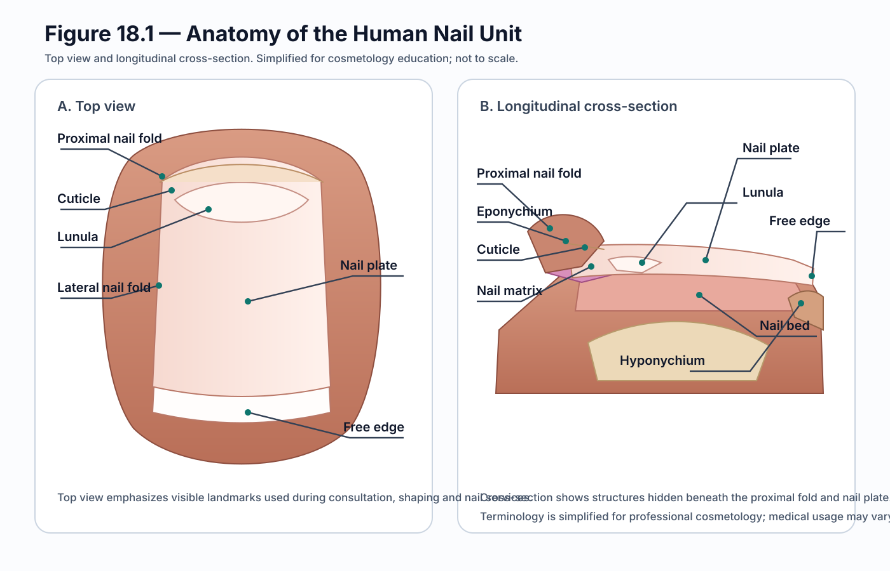

# Module 18 — Onychology, Manicure, Pedicure and Nail Technology

## Why This Matters

Onychology is the study of nails and the nail unit. A professional cosmetologist needs more than the ability to shape, polish, or enhance a nail. Safe nail practice depends on understanding the structures being treated, how the nail grows, which tissues are living, how protective barriers function, and when a visible change requires caution or referral.

This chapter begins with the scientific foundation of the nail unit before moving into manicure, pedicure, enhancement systems, product chemistry, tools, safety, contraindications, and professional decision-making.

## Learning Outcomes

By the end of this section, the learner should be able to:

- define onychology;
- identify the major structures of the nail unit;
- explain the basic function of each structure;
- describe how the nail plate grows;
- relate nail anatomy to manicure, pedicure, and enhancement services;
- distinguish normal professional observation from medical diagnosis;
- explain why protecting living tissue is essential during nail services.

## Scientific Disciplines

- Onychology
- Anatomy
- Histology
- Physiology
- Microbiology
- Cosmetic Chemistry
- Infection Prevention

## Key Terminology

- nail unit
- nail plate
- nail bed
- nail matrix
- lunula
- proximal nail fold
- lateral nail fold
- eponychium
- cuticle
- hyponychium
- free edge
- keratinisation

## Required Visuals

- **Figure 18.1 — Anatomy of the Nail Unit** — complete and embedded.
- Figure 18.2 — Nail Growth from the Matrix — planned.
- Figure 18.3 — Common Nail Shapes — planned.
- Figure 18.4 — Nail Structure for Enhancements — planned.
- Figure 18.5 — Nail Service Safety Decision — planned.

## 1. What Is Onychology?

**Onychology** is the study of nails and the nail unit.

In professional cosmetology, onychology includes:

- nail structure and growth;
- manicure and pedicure science;
- nail enhancement systems;
- product chemistry;
- infection prevention;
- visible abnormalities;
- contraindications;
- professional scope and referral.

Understanding nail science helps a cosmetologist protect the natural nail, choose appropriate services and products, and recognise when a service should be modified, postponed, or refused.

## 2. Anatomy of the Nail Unit

**Figure 18.1:** Top view and longitudinal cross-section of the human nail unit. The figure shows the proximal nail fold, eponychium, cuticle, lunula, nail plate, lateral nail folds, free edge, nail matrix, nail bed, and hyponychium.

The **nail unit** includes the nail plate, the tissues that produce and support it, and the skin folds that surround it.

Some structures can be seen from the surface. Others lie beneath the nail plate or proximal nail fold and are better understood in cross-section.

### 2.1 Nail Plate

The **nail plate** is the hard, translucent structure commonly called the nail.

It is formed from compact keratinised cells and protects the distal finger or toe. The nail plate also provides the working surface for polish, gel, acrylic, tips, wraps, and other cosmetic systems.

### 2.2 Free Edge

The **free edge** is the distal part of the nail plate that extends beyond the nail bed and fingertip.

This is the part most commonly shortened, filed, and shaped during manicure or pedicure.

### 2.3 Nail Bed

The **nail bed** is the vascular tissue beneath most of the nail plate.

It supports and anchors the plate as it grows forward. Its blood supply contributes to the pink appearance visible through a healthy translucent plate.

### 2.4 Nail Matrix

The **nail matrix** is the principal growth region that produces the nail plate.

It lies mainly beneath the proximal nail fold and extends distally toward the lunula. Matrix cells divide, keratinise, flatten, and become incorporated into the growing nail plate.

Damage to the matrix can affect nail thickness, surface, shape, or growth.

### 2.5 Lunula

The **lunula** is the pale crescent sometimes visible at the proximal end of the nail.

It represents the visible distal portion of the matrix in nails where it can be seen clearly. It may be prominent on some fingers and barely visible on others.

### 2.6 Proximal Nail Fold

The **proximal nail fold** covers and protects the emerging nail plate and the underlying matrix region.

Because the matrix lies beneath this area, aggressive cutting, pressure, or drilling near the proximal nail fold can damage structures responsible for nail growth.

### 2.7 Lateral Nail Folds

The **lateral nail folds** border the sides of the nail plate.

They help protect the nail unit from trauma and contamination and should not be aggressively cut or forced apart during a service.

### 2.8 Eponychium and Cuticle

Terminology varies between medical and salon literature.

For cosmetology practice, it is useful to distinguish the **living tissue at the proximal nail fold** from the thin **keratinised cuticle material** that extends onto and adheres to the nail plate.

Living tissue should not be aggressively cut. Any non-living cuticle removal should be gentle and limited to tissue that can be removed safely.

### 2.9 Hyponychium

The **hyponychium** is the tissue beneath the free edge where the nail bed transitions to the skin of the fingertip.

It contributes to the protective barrier at the distal end of the nail unit.

Do not dig deeply beneath the free edge because trauma to this area can cause pain, bleeding, and loss of barrier protection.

## 3. How the Nail Grows

The nail plate grows as new material is produced in the matrix.

The simplified sequence is:

1. matrix cells divide;
2. the cells move toward the developing plate;
3. they keratinise and flatten;
4. new plate material pushes the existing nail plate forward over the nail bed.

Fingernails generally grow faster than toenails, but growth rate varies with age, anatomical site, trauma, health, and other physiological factors.

## 4. Functions of the Nails

The nails:

- protect the tips of the fingers and toes;
- support fine manipulation and picking up small objects;
- provide counter-pressure that assists fingertip sensation and precision;
- contribute to scratching, grooming, and appearance.

## 5. Professional Application

A cosmetologist studies nail anatomy so they can:

- avoid damaging living tissue;
- prepare the natural plate without unnecessary thinning;
- shape the free edge safely;
- place enhancements with appropriate balance and stress distribution;
- recognise visible changes that require caution;
- provide appropriate aftercare;
- protect the natural nail between services.

### SALON APPLICATION

Excessive filing, drilling, or pressure can thin the nail plate or traumatise the tissues beneath it.

Longer extensions also increase mechanical leverage. This increases stress on the natural nail and makes correct structure and balance more important.

## 6. Safety and Contraindications

### RED FLAG

Pause the service and assess carefully when you observe:

- open wounds or active bleeding;
- severe inflammation;
- painful swelling or marked tenderness;
- visible changes suggesting infection;
- unexplained nail separation;
- severe or unusual discolouration;
- an active reaction to a nail product or previous service.

A cosmetologist may observe and describe visible findings, identify contraindications, and decide whether to proceed, modify, postpone, or refer.

Medical diagnosis and treatment belong to appropriately qualified healthcare professionals.

## Client Case Study

A client requests gel extensions for an event. During consultation you observe partial separation of two nail plates and unusual yellow-brown discolouration.

Consider:

1. What structures of the nail unit are involved?
2. Should the area simply be covered with an enhancement?
3. What additional questions should be asked?
4. What findings would cause you to postpone the service?
5. How would you explain referral professionally without making a diagnosis?

## Chapter Summary

- Onychology is the study of the nails and nail unit.
- The nail plate is the visible hard structure used as the working surface in most nail services.
- The matrix is the principal growth region responsible for producing the nail plate.
- The nail bed supports and anchors the plate.
- The proximal and lateral folds protect the nail unit.
- The hyponychium protects the distal underside of the nail.
- Living tissue should not be aggressively cut or traumatised.
- Nail anatomy guides safe manicure, pedicure, enhancement, and referral decisions.

## Knowledge Check

1. Define onychology.
2. Name at least eight structures of the nail unit.
3. Which structure is the principal growth region of the nail plate?
4. What is the difference between the nail plate and nail bed?
5. What is the function of the hyponychium?
6. Why should living proximal tissue not be aggressively cut?
7. Why is nail anatomy important before applying enhancements?
8. What is the difference between recognising a visible abnormality and diagnosing a disease?

## Further Reading

- StatPearls. *Onychoscopy* — Nail Unit Anatomy and Physiology.
- StatPearls. *Histology, Nail*.
- DermNet. *Nail terminology* and nail anatomy reference material.

